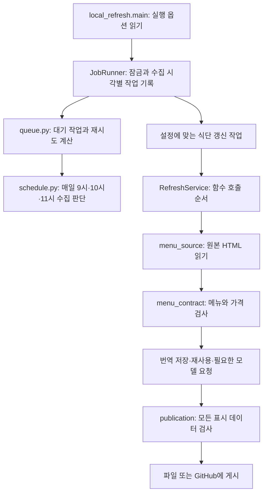

# 코드가 담당하는 일과 파일 위치

이 사이트에는 두 실행 부분이 있습니다. 식단 갱신 Python 프로그램은 원본 페이지를 읽어 메뉴·번역 JSON을 준비합니다. 이용자의 브라우저에서 실행되는 JavaScript는 웹서버가 제공한 JSON을 읽어 화면을 만듭니다. 브라우저 요청을 처리하는 Python 웹 백엔드나 데이터베이스 엔진은 없습니다.

이 문서에서 유지보수자는 코드와 번역 문구를 수정하는 사람이고, 운영자는 실행 계정·모델 파일·웹서버·자동 실행을 준비하는 사람입니다. 공개하지 않는 작업 기록 폴더와 브라우저가 읽는 웹사이트 폴더는 운영자가 따로 지정합니다.

## 식단 갱신을 한 번 실행할 때

실행 진입점 [`scripts/local_refresh.py`](../scripts/local_refresh.py)의 `main` 함수는 운영자가 전달한 `--config` 또는 `--base`를 읽습니다. 설정 파일을 사용하는 경우 경로와 값을 검사하는 `load_worker_config` 함수([`mensa/config.py`](../mensa/config.py))를 호출합니다. `--status`가 있으면 main은 작업 기록의 `queue.json`과 `last-result.json`만 읽고 내용을 출력합니다.

대기 작업을 실행하는 `JobRunner` 클래스([`mensa/jobs.py`](../mensa/jobs.py))는 공개하지 않는 작업 기록 폴더를 준비하고 `worker.lock` 파일에 OS 파일 잠금을 겁니다. 이 잠금은 두 프로그램이 같은 `queue.json`을 동시에 고치지 못하게 합니다. 다른 실행이 잠금을 보유하면 JobRunner는 기다리지 않고 `busy`를 반환하며 queue.json과 last-result.json을 바꾸지 않습니다. 잠금을 얻은 JobRunner는 대기 작업과 메모리/CPU 기준을 확인합니다. 작업이 성공했을 때만 queue.json의 completed_period(완료 수집 시각)를 저장합니다. last-result.json에는 완료뿐 아니라 작업 없음(idle), 재시도 대기(waiting), 실행 조건 미충족(deferred), 실패(failed), 자동 재시도 중지(blocked) 결과도 저장합니다. 이 결과 파일을 쓸 때도 잠금을 유지합니다.

예정 수집 시각을 계산하는 함수는 [`mensa/schedule.py`](../mensa/schedule.py)에 있고, 대기 작업과 실패 후 재시도 시간을 관리하는 함수들은 [`mensa/queue.py`](../mensa/queue.py)에 있습니다. JobRunner는 이 함수들이 반환한 내용을 파일에 저장합니다. 실패하면 JobRunner는 중간에 저장된 queue.json을 다시 읽고 다음 재시도 시간을 기록합니다. 프로그램 중지 요청은 위로 전달되어 파일 잠금이 해제됩니다.

식단 갱신의 호출 순서를 관리하는 **Python 클래스** `RefreshService`는 [`mensa/refresh_service.py`](../mensa/refresh_service.py)에 있습니다. 이 클래스는 원본 수집 함수를 호출하고, 메뉴/가격 검사와 현재 날짜 검사를 통과하면 번역 함수를 호출합니다. 이어 모든 필요한 번역과 주의 표시가 있는지 검사하고 파일 게시 함수를 호출합니다. 실제 HTTP는 원본 수집 함수가, 모델 요청은 번역 함수가, 파일 쓰기는 게시 함수가 수행합니다. RefreshService는 Linux 자동 실행 설정 파일 `deploy/mensa-refresh.service`와 별개의 이름입니다.

유지보수자가 테스트할 때는 RefreshService에 원본/번역/게시 함수를 인자로 전달할 수 있습니다. 예를 들어 원본 페이지를 가져오는 함수 대신 저장된 HTML을 읽는 함수를 전달하면 네트워크 없이 같은 검사 순서를 확인할 수 있습니다. 데이터 검사 함수에는 HTTP나 파일 쓰기를 넣지 않고, 어느 함수를 어떤 순서로 실행할지는 RefreshService에서 관리해 주세요.

아래 그림은 처리 순서를 나타냅니다. 각 단계의 함수를 호출하는 주체는 위에서 설명한 실행 클래스이며, 화살표가 인접한 두 함수의 직접 호출을 뜻하지는 않습니다.

## 파일을 웹사이트 폴더에 직접 게시하는 경우

설정의 `publication.mode = "directory"`를 처리하는 `DirectoryRefreshJob` 클래스([`mensa/directory_refresh.py`](../mensa/directory_refresh.py))는 코드 폴더의 `data/notice-translations.json`을 한 번 읽습니다. 이 파일은 사람이 검토한 독일어 주의 표시의 영어/한국어 대응표입니다. DirectoryRefreshJob은 이 표와 Berlin 기준 오늘 날짜를 번역·검사·게시 함수에 전달합니다.

현재 웹사이트에 식단이 있으면 DirectoryRefreshJob은 `data/current.json`이 지정한 메뉴/번역을 이전 데이터로 읽습니다. 첫 게시라서 지정 파일이 없으면 코드 폴더의 `site/data/menu.json`과 `translations.json`을 읽습니다. 이 클래스는 코드 폴더나 Git을 수정하지 않으며 HTML/CSS/JavaScript도 생성하지 않습니다.

공개할 두 JSON 파일을 쓰는 `DirectoryPublisher` 클래스([`mensa/releases.py`](../mensa/releases.py))는 두 파일의 내용을 묶어 계산한 ID를 폴더 이름으로 사용합니다. 완성된 `data/releases/<ID>/menu.json`과 `translations.json`을 만든 뒤 `data/current.json`을 교체합니다. 이전 ID의 파일은 남깁니다. 파일을 게시한 후 JobRunner가 완료 기록 저장에 실패하면, 다음 실행은 식단을 다시 수집하면서 이미 저장한 번역을 재사용합니다. 게시 파일과 수집 시각별 완료 기록은 서로 다른 파일에서 관리합니다.

## 필요한 번역과 모델 실행

번역 준비를 맡는 `TranslationService`([`mensa/translation_service.py`](../mensa/translation_service.py))는 검토된 구문과 이미 저장된 번역을 먼저 사용합니다. 번역 재개 함수 `resume_translations`([`mensa/translation_runner.py`](../mensa/translation_runner.py))는 현재 메뉴에 필요한 번역을 확인하고 이전에 완료한 항목을 다시 사용할 수 있는지 판단합니다.

설정 기반 재개 함수 `resume_configured_translations`([`mensa/translation_runtime.py`](../mensa/translation_runtime.py))는 완료된 번역을 저장하는 `TranslationCheckpointStore`([`mensa/checkpoints.py`](../mensa/checkpoints.py))를 호출합니다. 저장 파일 `translation-checkpoint.json`에는 이미 검사를 통과한 요리별 번역이 들어갑니다. 일부 요리가 아직 미완료일 수 있으므로 운영자가 이 파일을 웹사이트에 직접 복사하면 안 됩니다.

새 번역이 필요한 순간에만 모델 실행을 관리하는 `model_session` 함수([`mensa/model_runtime.py`](../mensa/model_runtime.py))를 호출합니다. `managed` 설정이면 이 함수는 준비된 Ollama 실행 파일을 별도 프로세스 그룹으로 시작하고 요청이 끝나면 자신이 만든 그룹만 종료합니다. 컴퓨터에서 따로 실행 중인 Ollama는 종료하지 않습니다. `external` 설정이면 이미 실행 중인 모델의 URL을 사용하며 그 프로세스를 시작하거나 종료하지 않습니다. 번역 재개 함수는 모델 정리를 끝낸 뒤에 메뉴/번역을 게시 함수에 넘깁니다.

번역 요청을 보내는 `request_translation`([`mensa/generation.py`](../mensa/generation.py))은 응답 크기·완료 여부·언어별 결과·구성품 개수를 검사합니다. 실패 종류를 나타내는 `GenerationError`와 다시 요청할 수 있는 오류 구분은 [`mensa/errors.py`](../mensa/errors.py)에 있습니다.

## GitHub에 데이터를 보내서 게시하는 경우

설정의 `publication.mode = "github"`를 처리하는 `ConfiguredRefreshJob`은 [`scripts/local_refresh.py`](../scripts/local_refresh.py)에 있습니다. 이 클래스는 쓰기 가능한 전용 main 코드 폴더에서 `site/data/menu.json`과 `translations.json`의 변경만 게시용 커밋으로 준비합니다. Mac `--base`의 `RefreshJob`도 같은 GitHub 게시 절차를 사용하되 고정 경로와 모델 정책을 적용합니다.

게시용 Git 커밋과 복구 기록을 관리하는 `SnapshotRepository`([`mensa/git_repository.py`](../mensa/git_repository.py))는 이 워커가 두 데이터 JSON을 기록해 만든 커밋을 확인합니다. 문서와 코드에서 이 커밋을 소유 커밋이라고 부릅니다. SnapshotRepository는 snapshot-journal.json의 부모 커밋·Git 트리·데이터 파일 내용을 대조해 실제로 워커가 만든 변경인지 판단합니다. 커밋 메시지만으로 소유 여부를 판단하거나 사람이 만든 변경을 버리지 않습니다.

게시 준비 중 원격 main이 앞서가면 SnapshotRepository의 plan_replacement/resume_replacement는 두 이력을 구별합니다. 원격 main 이력에 워커의 기존 커밋이 이미 들어 있으면 로컬 main을 원격 main 위치까지 앞으로 이동합니다(fast-forward). 기존 커밋이 main 이력에 남아 있으므로 이 경우에는 refs/mensa/superseded/<SHA>를 만들지 않습니다. 원격 main이 기존 커밋을 포함하지 않고 두 이력이 갈라졌다면, 클래스는 워커가 만든 커밋인지와 기록된 출발 커밋이 원격 main에 남아 있는지를 확인한 뒤 기존 커밋을 refs/mensa/superseded/<SHA>에 보존합니다. 프로그램은 최신 main에서 식단을 다시 수집하고 새 게시용 데이터 커밋을 준비합니다. 이 새 커밋을 대체 커밋이라고 부릅니다. 소유 여부를 확인할 수 없는 변경·사람의 변경·알 수 없는 커밋은 보존하며 운영자가 검토합니다. 대체 커밋과 이전 게시 실행이 충돌하는 경우도 운영자가 확인해야 합니다.

GitHub 실행을 요청하고 조회하는 `GitHubPublication`([`mensa/github_publication.py`](../mensa/github_publication.py))은 지정 repository/workflow에서 같은 커밋의 실행을 찾고, 게시 실행 요청(dispatch), 진행 확인(watch), 실패 실행 재요청(rerun)을 수행합니다. ConfiguredRefreshJob은 요청 시각을 queue.json에 먼저 저장하고 발견한 실행 번호(run_id)를 진행 확인 전에 저장합니다. 운영자가 복구할 때는 이 번호를 보존해야 이미 게시한 작업을 중복 요청하거나 잊지 않습니다.

## 어느 파일을 수정해야 하는지 찾기

| 수정할 내용 | 담당 파일과 함수의 일 |
| --- | --- |
| 원본 페이지 형태 | [`scripts/menu_source.py`](../scripts/menu_source.py)가 HTML을 읽고 메뉴를 추출하며, 별도 항목 개수 검사와 대조합니다. |
| 날짜·ID·가격 규칙 | [`mensa/menu_contract.py`](../mensa/menu_contract.py)가 메뉴 형식과 같은 원본 가격의 정수 센트를 검사합니다. |
| 번역 key·표현·재사용 | [`mensa/translation_contract.py`](../mensa/translation_contract.py)가 원문으로 key를 계산하고 번역 형식/표현/모델 버전을 검사합니다. |
| 주의 표시·전체 게시 가능 여부 | [`mensa/notice_contract.py`](../mensa/notice_contract.py)와 [`publication.py`](../mensa/publication.py)가 검토 대응표와 모든 메뉴 번역을 검사합니다. |
| 검토 문구 입력 | [`scripts/notices.py`](../scripts/notices.py)가 대응표를 읽으며, 유지보수자는 `data/notice-translations.json`과 `data/editorial-translations.json`을 편집합니다. |
| 설정·컴퓨터 여유 확인 | [`mensa/config.py`](../mensa/config.py)가 TOML 값을 검사하고 [`resources.py`](../mensa/resources.py)가 메모리/CPU/전원 정보를 읽습니다. |
| 직접 입력 갱신·호환 명령 | [`scripts/update_menu.py`](../scripts/update_menu.py), [`translations.py`](../scripts/translations.py), [`refresh_queue.py`](../scripts/refresh_queue.py)가 수동 파일 갱신·환경변수 설정·Mac 리소스 판단을 연결합니다. |
| 게시용 사이트 생성 | [`scripts/build_site.py`](../scripts/build_site.py)가 입력 HTML/CSS/JavaScript와 메뉴/번역을 새 폴더에 모읍니다. |

## 브라우저가 JSON을 읽고 화면을 바꾸는 순서

브라우저 시작 코드 [`frontend/main.ts`](../frontend/main.ts)는 파일 요청과 JSON 읽기에 15초 제한을 적용합니다. 파일 읽기 코드 [`data_client.ts`](../frontend/data_client.ts)는 data/current.json을 한 번 읽고 그 ID의 두 파일을 동시에 요청합니다. 데이터 검사 코드 [`contracts.ts`](../frontend/contracts.ts)는 받은 값이 정해진 메뉴/번역 형식인지, 번역이 해당 독일어 원문에 연결되는지 확인합니다. 브라우저는 두 파일의 SHA256을 다시 계산하지 않습니다.

화면 상태를 저장하는 [`state.ts`](../frontend/state.ts)는 선택 날짜·언어·가격 그룹과 메뉴/번역 로딩 결과를 보관합니다. 사용자 입력과 파일 응답을 처리하는 [`controller.ts`](../frontend/controller.ts)는 오래된 요청의 응답이 새 선택을 덮어쓰지 못하게 합니다. 유효한 메뉴가 먼저 도착하면 화면은 독일어로 요리를 보여 주고 번역 파일을 받으면 언어별 표현을 보완합니다. 번역 파일 실패 때문에 이미 읽은 메뉴를 숨기지 않습니다.

표시 메뉴를 고르는 `visibleMeals(day)`([`selectors.ts`](../frontend/selectors.ts))는 같은 날짜의 항목 중 ID를 제외한 모든 내용이 같은 첫 번째 항목만 반환합니다. 원본 수집 코드가 각 반복 발생에 붙인 ID는 원본 JSON과 앱 상태에 모두 남습니다. 일간/주간 화면을 그리는 [`render.ts`](../frontend/render.ts)는 두 보기에서 이 함수를 사용하고 [`cards.ts`](../frontend/cards.ts)는 첫 번째 ID로 카드와 열린 상세 상태를 유지합니다. 메뉴 이름이나 가격 그룹 하나가 같다는 이유로 다른 요리를 합치지 않습니다.

주간 날짜 범위를 표시하는 rangeLabel 함수는 같은 해에서는 월·일을 간결하게 표시하고, 연도가 바뀌면 두 해를 모두 표시합니다. 좁은 화면에서 긴 날짜 범위는 줄을 나누어 이동 버튼과 겹치지 않게 합니다. 날짜·가격 선택의 라벨과 값은 공간이 허용하는 한 같은 줄에 놓습니다.

화면 문구와 표시값은 [`copy.ts`](../frontend/copy.ts)/[`display.ts`](../frontend/display.ts)가 만들고, HTML 요소 생성과 연결은 [`dom.ts`](../frontend/dom.ts)/[`app.ts`](../frontend/app.ts)가 맡습니다. 언어·가격·번역 변경 때 화면 코드는 선택 날짜와 열린 상세를 유지합니다. 사용자가 날짜·주·보기 방식을 바꾸면 app.ts의 navigate 함수는 메뉴를 갱신하고 변경 내용을 보조기기의 읽기 영역에 알립니다. navigate 함수는 날짜 버튼과 날짜 선택창 등 화면에 남아 있는 선택 도구의 키보드 초점을 유지하며, 별도의 스크롤 명령을 실행하지 않습니다. 주간 화면의 “하루 보기” 버튼은 일간 화면으로 전환할 때 사라지므로, 이 경우에만 navigate 함수가 날짜 선택창으로 키보드 초점을 옮깁니다. 이 초점 이동에도 preventScroll 옵션을 사용하여 화면 위치를 유지합니다.

## 게시용 파일에 포함하는 범위

사이트 생성 프로그램은 `frontend/main.ts`에서 컴파일된 main.js와 그 파일이 정적 import/re-export로 참조하는 JavaScript를 따라갑니다. 이 파일들만 `assets/<graphID>/`에 모으고 CSS에는 내용 해시가 붙은 이름을 사용합니다. HTML은 이 경로를 참조합니다. 이전 HTML을 저장한 브라우저를 위해 `app.js` 연결 파일과 `styles.css` 대체 이름도 만듭니다.

운영자는 생성된 HTML/favicon/JavaScript/CSS와 선택된 메뉴·번역 파일만 웹서버에 연결해 주세요. TypeScript 원본·source map·queue.json·번역 중간 기록·모델·로그를 공개하지 않습니다. 공개 JSON의 정확한 필드는 [데이터 설명](data-contract.md), 파일 권한과 재시도 절차는 [운영 문서](operations.md)에 있습니다.
